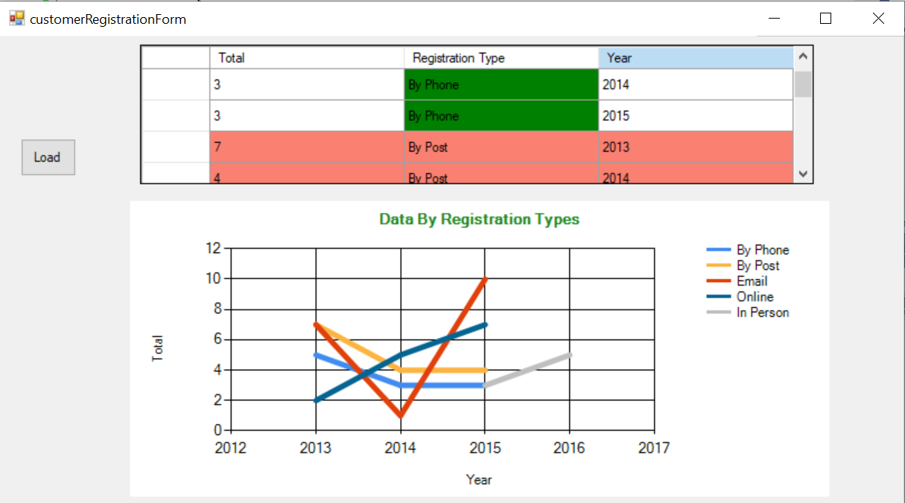

# csharp-data-visualization

I've always wanted to learn how to visualize data in C#. My wishes came true after I came across a great youtube tutorial. The tutorial was in Urdu, a language I do not understand but credit to the author who wrote clear, clean code I could follow 😐

This tutorial displays fictional customer registration data using a datagridview and a line chart using C#. I added a few modifications to what I learned from the tutorial. I added the coloring to the datagridview and also added code to change the chart type from a column chart to a line chart.
You can check out the video here:
https://www.youtube.com/watch?v=rZ9QzUMOQJs

